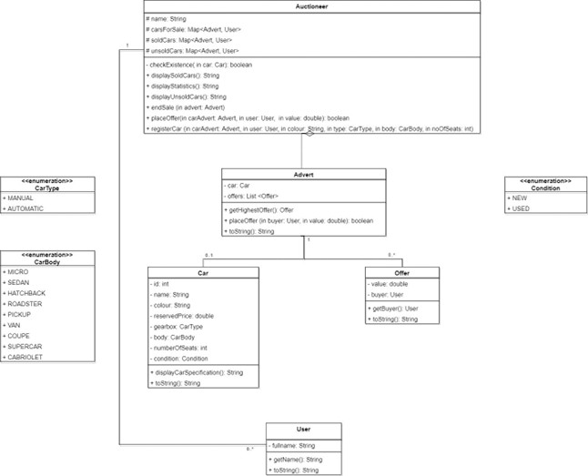

# Java Programming Fundamentals

This repository is an archive of my university coursework, focusing on object-oriented programming in Java. It includes a multi-part car auction simulation and a series of lab exercises that introduce fundamental Java concepts.

## Coursework: Car Auction Simulation

The main coursework project is a command-line simulation of a car auction system.

*   **Features:**
    *   **User Roles:** Distinction between regular users and auctioneers.
    *   **Vehicle Adverts:** Users can create and view advertisements for cars, which have different types, body styles, and conditions.
    *   **Bidding System:** Users can make offers on cars, and the system manages the bidding process.
    *   **Data Management:** The system saves statistics about auctions and trades to text files.

### Coursework UML Diagrams
**Question 1**

**Question 2**

**Question 3**

**Question 4**


## Lab Exercises

This repository also contains a series of labs, each designed to teach a specific Java concept.

*   **Lab01: Hello World** - A basic introduction to the Java language and environment.
*   **Lab02: Object-Oriented Concepts** - Focuses on creating objects and modeling their interactions.
*   **Lab03: Object-Oriented Modelling** - Deeper modeling of real-world entities like employees and positions.
*   **Lab04: Collections** - Introduction to Java's collection framework for managing groups of objects.
*   **Lab05: Arrays and Loops** - Using arrays and loops for data processing and calculations.
*   **Lab06: Enums and Maps** - Using enums for constant values and maps for key-value data.
*   **Lab07: Advanced Collections** - More complex use of collections to manage object relationships.
*   **Lab08: File I/O and Exception Handling** - Reading from and writing to files, and creating custom exceptions.
*   **Lab09: Abstract Classes and Interfaces** - Designing flexible code using abstraction and polymorphism.
*   **Lab10: Interfaces and Polymorphism** - Further practice with interfaces in a hotel management scenario.
*   **Lab11: Final Project** - A larger design exercise modeling a factory, combining concepts from all previous labs.

## Getting Started

This repository contains multiple, separate Maven projects. Please ensure you have JDK 8 (or newer) and Maven installed on your system.

1.  Clone the repository:
    ```bash
    git clone https://github.com/sam-iv/Java-Programming-Fundamentals.git
    ```
2.  Navigate to the directory of the project you want to work with (e.g., `cd Coursework` or `cd Lab02`).

3.  To run the JUnit tests for the project, use the following Maven command:
    ```bash
    mvn test
    ```
    This was the primary method used to verify the code for both the coursework and the lab exercises.

## Technologies Used

This project is built using Java and Maven.

- ### Core Language & Build Tool:
    - **Java SE 8** - Core language for all projects.
    - **Maven** - Build and dependency management tool.
